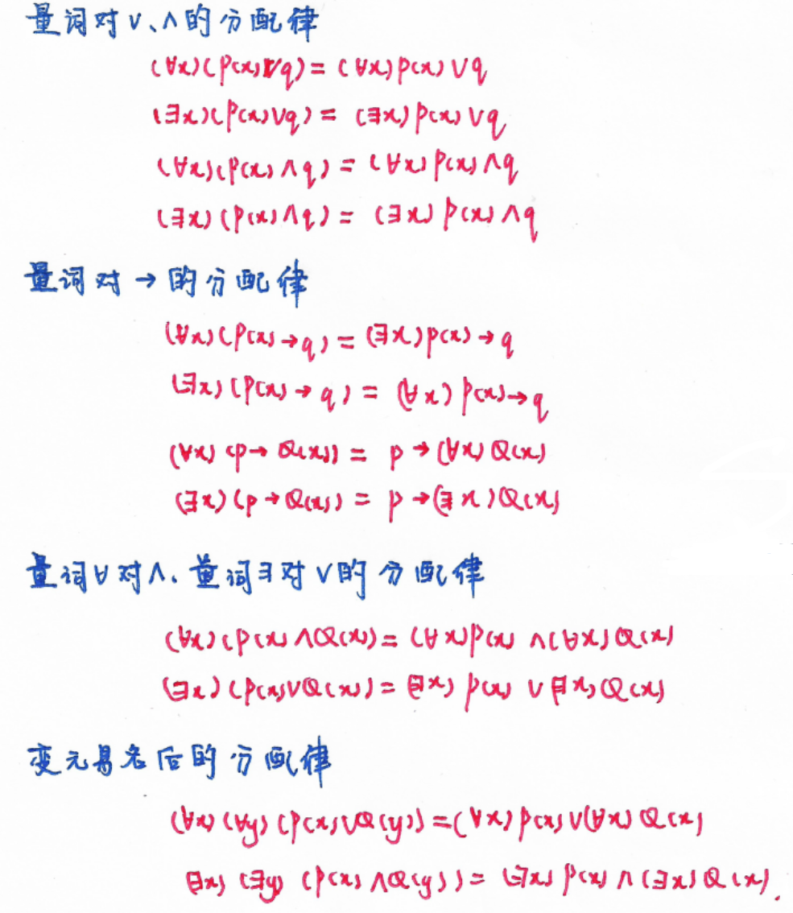
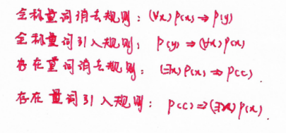

### **Chapter 4  谓词逻辑的基本概念**
#### **4.1 谓词与个体词**
- 4.1.1 谓词
  - 一元谓词
  - 多元谓词
- 4.1.2 个体词
  - 个体域 / 论域 D
  - 个体变项 / 个体变元
  - n项谓词
  - 谓词常项、谓词变项
- 4.1.3 谓词的定义
  - 仅当谓词变项取定为某个谓词常项，并且个体词取定为个体常项时，命题形式才化为命题。
  - 谓词的真值依赖于个体变元的论域。
  
#### **4.2 函数和量词**
- 4.2.1 函数
- 4.2.2 量词
  - 全称量词
  - 存在量词
- 4.2.3
  - 约束变元
  - 自由变元
  - 量词的辖域
  - 变元易名规则，如 $(\forall x)P(x) = (\forall y)P(y)$

#### **4.3 合式公式定义**
  - 命题常项、命题变项和原子谓词公式（不含联结词的谓词）都是合式公式。
  - 如果A是合式公式，则$\neg$ A也是合式公式。
  - 如果A，B是合式公式，而无变元x在A，B的一个中是约束的而在另一个中是自由的，则$A \wedge B$，$A \vee B$，$A \to B$，$A \leftrightarrow B$也是合式公式。
  - 如果A是合式公式，而x在A中是自由变元，则$(\forall x)$A，$(\exists x)$A也是合式公式。
  - 只有适合以上4条的才是合式公式。

#### **4.4 自然语句的形式化**

#### **4.5**
- 全称量词是合取词的推广
- 存在量词是析取词的推广

#### **4.6 公式的普遍有效性和判定问题**
- 对一个谓词公式来说，如果在它的任一解释 $I$ 下真值都为真，便称作普遍有效的。
- 对一个谓词公式来说，如果在它的某个解释 $I$ 下真值都为真，便称作可满足的。
- 对一个谓词公式来说，如果在它的任一解释 $I$ 下真值均为假，便称作不可满足的。

### **Chapter 5 谓词的等值和推理演算**
#### **5.1 否定型等值式**
- **谓词公式等值定义：** 若给定两个谓词公式A，B，说A和B是等值的，如果在公式A，B的任一解释下，A和B都有相同的真值。记做A=B。
- 5.1.1 由命题公式移植来的等值式
  - 若将命题公式的等值式，直接以谓词公式代入命题变项便可得谓词等值式。
- 5.1.2 否定型等值式
  - 否定词可越过量词深入到量词的辖域内，但要把所越过的全程量词转换为存在量词，存在量词转换为全称量词。
#### **5.2 量词分配等值式**

    
 

#### **5.3 范式**
- 5.3.1 前束范式
  - 说公式A是一个前束范式，如果A中的一切量词都位于该公式的最左边（不含否定词）且这些量词的辖域都延伸到公式的末端。
  - 谓词逻辑的任一公式都可化为与之等值的前束范式，但其前束范式不唯一。
  - 化前束范式步骤
    - 消去联结词
    - 否定词内移（反复使用摩根律）
    - 量词左移（使用分配等值式）
    - 边缘易名（使用变元易名分配等值式）
- 5.3.2 Skolem标准形
  - 如果对前束范式进而要求所有的存在量词都在全称量词之左，或是只保留全称量词而消去存在量词，便得Skolem标准形。Skolem标准形仅与原公式在某种意义下保持等值关系。
  - 存在前束范式
    - 定义
    - 谓词逻辑的任一公式A，都可化为相应的存在前束范式，并且A是普遍有效的当且仅当其存在前束范式是普遍有效的。
    - 普遍有效的公式与其存在前束范式是等值的，而一般的公式与其存在前束范式并不是等值的。
  - 另一种Skolem标准形是仅保留全称量词的前束形。
    - 定义：谓词逻辑的任一公式A，都可化为相应的Skolem标准形（只保留全称量词的前束形），并且A是不可满足的当且仅当其Skolem标准形是不可满足的。
    - 对不可满足的公式，其与Skolem标准形是等值的，而一般的公式与Skolem标准形并不等值。
  
#### **5.4 基本的推理公式**

 

#### **5.5推理演算**
- 5.5.1 推理规则

    
 

