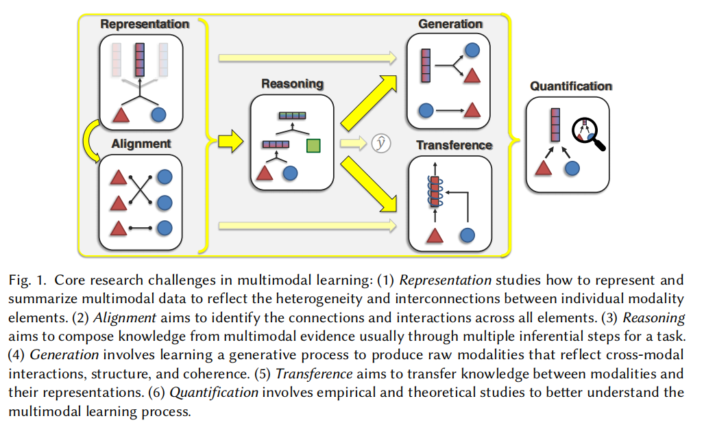

<i>Human knowledge is so vast, yet humans themselves are so small.</i>

The competition in the field of computer vision is so fierce that I have to extend my silly research into the area of multimodality.

Just kidding! Actually, I do believe that multimodal research is important. On the one hand, **perception is inherently multimodal and leveraging multimodal information may aid in making more accurate decisions.** For instance, humans perceive the world through eyes, ears, noses, etc. These sense organs as a whole play a key role in making us one of the most successful species. On the other hand, **modern models, particularly large language models (LLMs), offer a unified interface for different modalities, enabling the development of a truly multimodal system.**

I've put together a brief review here, based on an online lecture I watched before. But I have to say that I couldn't find the link at present.

Note: This brief review focuses on task performance and training efficiency, rather than inference efficiency, and does not consider deployment.

## Introduction

### What is multimodal
Merriam-webster's Dictionary of College English is unclear:
> multimodal: having or involving several modes, modalities, or maxima

A previous review [Liang et al., 2022] gives another definition:
> A modality refers to a way in which a natural phenomenon is perceived or expressed.
Multimodal refers to situations where multiple modalities are involved.

### Why multimodal
<ul>
  <li><b>Real</b>: Human perception of the external world is multimodal.</li>
  <li><b>Practical</b>: The internet and various applications are primarily multimodal.</li>
  <li><b>Effective</b>: Multimodal data contains richer information and is often easier to obtain (available textual information is nearly exhausted).</li>
</ul>

### Multimodal research challenges

Figure 1: Core research challenges in multimodal learning [Liang et al., 2022].

I recommend everyone to read this review [Liang et al., 2022], which goes beyond specific techniques to model and understand multimodal problems at a higher level.

### Example Applications
Take the applications between text and image as an example.

<ul>
  <li>Retrieval (Image&lt;&gt;Text)</li>
  <li>Caption (Image-&gt;Text)</li>
  <li>Generation (Text-&gt;Image)</li>
  <li>Visual Question Answering (Image + Text -&gt; Text)</li>
  <li>Multimodal Classification (Image + Text -&gt; Label)</li>
  <li> Better Understanding & Generation (Image + Text -&gt Label/Text)
</ul>

## Model Evolution
Multimodal learning is not confined to specific tasks. Actually, it spans multiple technological eras and exhibits many common characteristics across these eras. Therefore, this section will primarily follow the timeline of technological eras to trace the evolution of multimodal model structures, thereby revealing the development trajectory of multimodal learning. In particular, vision and language are the most extensively studied tasks, and this section will focus on detailed discussions through multimodal tasks between images and text.

### Early Models
Since the mid-20th century, multimodal learning has remained a major research area in artificial intelligence. Given that deep learning has become the prevailing method for realizing artificial intelligence today, this section begins with an introduction to research related to neural networks.

#### Typical Early Studies
In the early 2000s, fundamental modern deep learning components, such as MLP and word embedding, were already in use. By the middle of the decade, deep learning models (e.g., CNN, RNN, GNN) had already achieved state-of-the-art performance in various tasks. Additionally, generative models like GANs also appeared. At the end of the decode, the widespread application of Transformer provided a similar paradigm for different tasks, driving the overall development of the field of artificial intelligence. Until today, deep learning technology is still on the rise.

## References
[Liang et al., 2022] Liang, Paul Pu, Amir Zadeh, and Louis-Philippe Morency. <a href="https://arxiv.org/abs/2209.03430" class="no-underline" style="color:blue">"Foundations and recent trends in multimodal machine learning: Principles, challenges, and open questions."</a> arXiv preprint arXiv:2209.03430 (2022).

