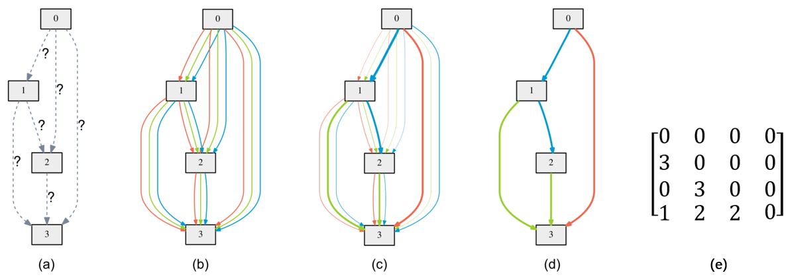
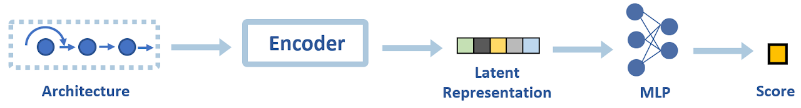
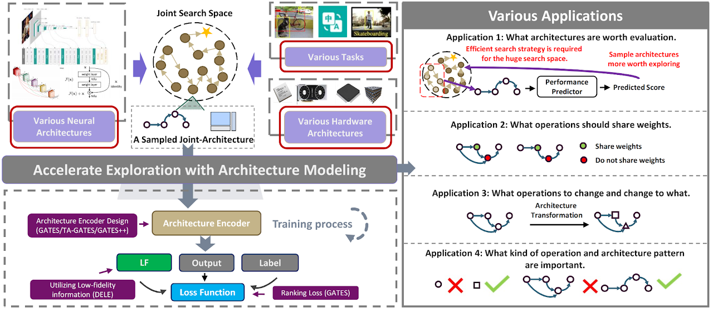

With the wide application of deep learning technology, the updated speed of neural architecture and demand for computing power is increasing daily. As a result, there is an urgent need for multi-level optimization for task performance and hardware overhead, from neural network architecture to hardware architecture.

However, the search space is always so huge that efficient evaluation methods are required to accelerate the exploration. For example, use a simulator or look-up table to evaluate hardware overhead and apply weight sharing approach to evaluate neural architecture performance. Unfortunately, efficiency and accuracy do not always go hand in hand. In other words, acceleration of the search process usually comes at the expense of discovering sub-optimal architectures. To solve this problem, learning architecture modeling to accelerate exploration and improve evaluation is an important research direction.

## Architecture Representation
Before formally discussing architecture modeling, we first briefly describe the architecture representation in neural architecture search. The so-called architecture representation is a structure that can represent a certain architecture in the search space. This is helpful for understanding the methodology of architectural modeling and its implications.

### Squential Architecture Representation
Considering the search space as shown in Figure 1, we search for operations between nodes from four candidate operations. The simplest architecture representation method is to serialize the architecture with the operation index on each edge sequentially. For example, the discovered architecture shown in Figure 1(d) can be represented as [3, 0, 1, 3, 2, 2].

This representation schema is called sequential architecture representation. On the one hand, sequential representation is so simple and general that it can represent architectures in any search space (topological or non-topological) as long as all the decisions are placed together in order. On the other hand, sequential representation also supports searching for other automatic machine learning elements such as learning rate, training epoch, optimizer type, etc. by simply adding the element to the list.

However, the drawbacks of sequential architecture representation are also prominent. On the one hand, this schema does not model the architecture topology. Unless knowing the specific encoding rules, we cannot infer the architecture from the architecture representation. On the other hand, decision representation also creates confusion. For example, considering the search space shown in Figure 1, although the difference between 3 and 0 is more significant than that between 2 and 0 numerically, it does not indicate that ''blue'' is more different from ''none'' than ''green''.

 Figure 1：An example search space. We search for operations on the edges from four candidate operations: none (denoted by 0), red (denoted by 1), green (denoted by 2) and blue (denoted by 3).

### Adjacent Matrix Architecture Representation
Neural architecture search is always performed in cell-based topological search spaces (e.g., DARTS [Liu et al., ICLR 2019] , ENAS [Pham et al., ICML 2018]). Since the cell can be modeled as a directed acyclic graph (DAG), we can represent the architecture with an adjacency matrix. For example, the architecture in Figure 1(d) can be represented as a 4 x 4 matrix A in Figure 1 (e), where A[i][j] denotes the selected operation index from node j to node i.

To a certain extent, the adjacent matrix architecture representation models architecture topology. However, many problems of the sequential architecture representation remain unsolved. Last but not least, this representation schema is not applicable in non-topological search spaces.

## Architecture Modeling
### Significance of Architecture Modeling
In this section, we start with the predictor-based neural architecture search to understand the significance of architecture modeling.

**Predictor-based NAS** methods utilize an approximate architecture performance predictor to sample architectures more worthy of evaluation, thereby reducing the number of architectures that need to be evaluated for more accurate but slower evaluation strategies. As show in Figure 2, a typical architecture performance predictor takes an architecture representation (such as an adjacency matrix) as input and predicts performance scores as output. It usually consists of two parts, an architecture encoder and a multilayer perceptron (MLP). Among them, the architecture encoder encodes the input architecture representation into a latent representation, and the multilayer perceptron maps the latent representation to the prediction score.

 Figure 2: Typical architecture performance predictor framework. The architecture is first encoded by an architecture encoder and then fed into the MLP to output the final prediction score.

For predictor-based neural architecture search, existing architecture encoding schemes mainly include sequence and graph-based schemes. Sequence-based schemes use specific serialization methods to convert architectural decisions into sequences (sequential architecture representation), which are then fed into a multilayer perceptron or recurrent neural network to obtain architectural representations. Graph-based architecture encoders apply graph convolutional networks to encode neural network architectures. Architecture predictors can generally give an approximate performance estimate of architecture in milliseconds and are, therefore, very efficient.

**The process of encoding the architecture is itself the process of modeling the architecture. With limited data, the predictive power of architecture performance predictors is closely related to the applied architectural encoders.** Figure 3 compares four architecture encoders on four benchmarks. It can be observed that trained on the same training samples, the prediction ability of predictors using different architecture encoders is significantly different. For example, GNN-based TA-GATES achieves significantly better prediction precision than the most naive MLP (sequence encoding scheme).

Why is the architecture modeling in predictor-based NAS such significant?

- On the one hand, an exemplary architecture modeling scheme can extract and integrate valid information from the architectural representation.
- On the other hand, prior knowledge can be introduced to reduce the data requirement further.

Take the sequence-based schemes as an example. As mentioned above, although sequence-based can accurately represent a specific architecture, it can hardly reflect the inherent properties of the architecture. For example, they are challenging to reflect topological information, and numerical distances between encodings cannot reflect fundamental performance differences. Such problems make it difficult to mine enough adequate information from limited data and not rank the performance of different architectures well, thus affecting the search results.

Figure 4 illustrates the gerneral working flow and various applications of architecture modeling：

- Architecture search acceleration by sampling architectures that are more worth exploring (as discussed above).
- More accurate architecture performance estimation that benefits architecture search.
- Architecture transformation that tells us how to transform an architecture for better performance under a certain application scenario.
- Architecture understanding that conducts model-based explanation of the relationship between architecture pattern and performance.

For the first application, we conduct a series of studies (GATES, TA-GATES, GATES++, DELE, Gibbon) to design advanced architecture encoders or training strategies. For the second application, we propose a novel CLOSENet that decouples the parameters from operations to improve one-shot estimation quality in CLOSE. And for the third application, we transform the architectures of given networks to improve the AI security under various attacks in DeepGuiser. For the last application, some studies (e.g, NAS-Bowl [Ru et al., ICLR 2021]) gain understanding of the relationship between architecture and performance in a search space.

In the following sections, we will further introduce the application of architecture modeling to these tasks.

### Architecture Modeling Application：Architecture Search
As discussed above, architecture modeling plays a crucial role in neural architecture search. Our work centers around a core idea: Through learnable modeling of the search space (i.e., a performance predictor of architectures), we can know which search space regions are worth exploring, and thus accelerate the exploration process. This section will take our researches as the main thread and share our views on the application of architecture modeling to architecture search tasks. Specifically, we'll introduce:

- The role of architecture modeling in predictor-based NAS.
- The significance of architecture modeling for improving one-shot evaluation.
- The role of architecture modeling in architecture-hardware joint search.

#### Architecture Modeling in Predictor-based Neural Architecture Search
Predictor-based NAS trains an approximate performance predictor and utilizes it to rank unseen architectures without actually training them. Therefore, once we have a predictor that can reliably rank the performance of unseen architectures, the architecture exploration can be significantly accelerated. However, predictor-based NAS suffers from the severe “cold-start” problem: It usually takes quite a considerable cost to acquire the architecture-performance data needed for training a working predictor from scratch.

To alleviate the need for training data for predictor-based neural architecture search, we sequentially conduct three studies： GATES, TA-GATES, and DELE. As shown in Figure 5, while the former two studies focus on designing more reasonable architecture encoders, the latter focuses on designing a more data-efficient training manner for better architecture modeling. We will briefly introduce them below.

**A Generic Graph-based Neural Architecture Encoding Scheme for Predictor-based NAS (GATES)**

Recognizing the high cost of getting actual architecture performance data as the major challenge for predictor-based NAS, to exploit information in the limited data more efficiently, we first propose GATES to learn the predictor in a more data-efficient way.

As described above, traditional architecture encoders treat architecture as a sequence or a simple DAG. However, they ignore that architecture should describe how the data flow and get processed. Following this intuition, the core of our proposed method is to mimic the data flow and processing process to encode the architecture. Specifically, in the encoding process of GATES, a piece of "virtual information" is taken as the input node embedding, and each operation is a transformation of the propagated information. Figure 6 shows an example of the encoding flow; more details can be found in our paper. The proposed GATES is a more suitable encoding method for data-processing directed acyclic graphs (DAGs) which matches the nature of this type of data. Indeed, it can intrinsically encode equivalent/isomorphic architectures to the same embedding.

**TA-GATES: An Encoding Scheme for Neural Network Architectures**

Even if two operations are of the same type, they have different functionalities according to their architectural context. However, plain GATES does not give contextualized embeddings for different operations of the same type. To solve this problem, we propose TA-GATES, a follow-up improvement to GATES, that can get contextualized embeddings for different operations (even those of the same type).

To get a more discriminative encoding, the intuition behind the principled design of TA-GATES is "an architecture not only describes how the data flow and get processed in the forward propagation, but it also decides the learning dynamics of the model." Accordingly, we propose to improve GATES from two aspects:

- Analogy to Iterative Parameter Training: Mimicking the architecture training process to encode it by conducting several forward and backward passes on the architecture DAG and updating the operation embedding in each backward pass (as illustrated in Figure 5 (Middle)).

- Analogy to Random Parameter Initialization: Applying symmetry breaking to the initial operation embeddings to enable TA-GATES to distinguish between symmetric operations (as illustrated in Figure 7).

**Dynamic Ensemble of Low-fidelity Experts: Mitigating NAS “Cold-Start” (DELE)**

Based on the intuition that "low-fidelity information can be beneficial for learning the modeling," DELE focuses on exploiting more information in other cheaper-to-obtain performance estimations (i.e., low-fidelity information) to mitigate the data requirements of predictor training. However, the types of low-fidelity information helpful for performance prediction are unclear to practitioners beforehand. In addition, different types of low-fidelity information could provide beneficial information from different aspects, but the naive method described above can only utilize one type of low-fidelity information.

To solve the problem, we propose a dynamic mixture-of-expert predictor framework to fuse beneficial knowledge from different low-fidelity experts. Specifically, as shown in Figure 5 (Right), each low-fidelity expert is trained with one type of low-fidelity information (e.g., zero-shot evaluation scores, complexity scores, and so on). Then a dynamic ensemble of these experts is trained using only a small set of ground-truth performance data.

Compared to previous studies that improve architecture modeling by designing specialized predictor architectures or training losses, DELE can be combined with these studies to boost performance further. For example, as shown in Table 2, with 1% training samples on NAS-Bench-201, DELE increases Kendall's Tau correlation between predicted scores (GATES) and actual performance from 0.7332 to 0.8244. The increasing ranking correlation will further lead to better-discovered architectures.

#### Architecture Modeling for Improving One-shot Estimation
Besides predictor-based NAS, architecture modeling is also significant to one-shot evaluation.

One-shot NAS shares operation parameters among candidate architectures in a “supernet” and trains this supernet to evaluate all sampled candidate architectures. However, one-shot NAS suffers from the poor ranking correlation between one-shot estimations and stand-alone estimations. And the excessive sharing of parameters, i.e., the large sharing extent, has been widely regarded as the most critical factor causing unsatisfying performance estimation.

**CLOSE: Curriculum Learning On the Sharing Extent Towards Better One-shot NAS**

To solve the problem brought by the traditional sharing mechanism, CLOSE achieves a win-win scenario of supernet training efficiency and high-ranking quality by adapting the sharing extent during the supernet training process.

The key idea behind CLOSENet is to decouple the parameters from operations to enable flexible sharing scheme and adjustable sharing extent. Specifically, as shown in Figure 8, CLOSE designs a novel CLOSENet, whose sharing extent can be easily adjusted to enable the adaption of the sharing extent during the training process. And CLOSE borrows the idea of curriculum learning to design a novel supernet training strategy, which not only accelerates the supernet training but also improves the saturating ranking quality of the supernet.

Figure 9 compares CLOSENet with vanilla supernets on four NAS benchmarks. CLOSENet achieves a higher KD and P@top5% on all the NAS benchmarks. Moreover, throughout the training process, CLOSENet consistently achieves higher ranking quality, which implies CLOSENet’s superiority to the vanilla supernet under any budget for supernet training.

#### Architecture Modeling in Architecture-Hardware Joint Search
Architecture modeling is not only for neural network architectures but also for hardware architectures.

As we know, neural network architecture and hardware architecture are two important aspects of the actual deployment of neural networks. However, most existing works either fix neural network architectures to optimize hardware architectures or design neural network architectures for a given hardware architecture, ignoring both co-design.

Neural Architecture Search (NAS) can be applied to explore the NN model and hardware architecture co-design space automatically. However, the vanilla NAS methods suffer from low exploration efficiency and long search time because of the explosive search space expansion and the time-consuming simulation of hardware architectures. To solve these problems, we need an efficient co-exploration framework for the NN model and hardware architecture by leveraging the power of architecture modeling.

**Gibbon: Efficient Co-Exploration of NN Model and Processing-In-Memory Architecture**

Gibbon proposes an evolutionary search algorithm with adaptive parameter priority to co-design the neural network architectures and the memristor-based Processing-In-Memory (PIM) architectures. Specifically, as shown in Figure 10, Gibbon models the neural network architecture and the PIM architecture jointly, and uses the difference form to model the impact of hardware irrational factors on the performance of the algorithm. The core of evaluation acceleration is an RNN-based NN accuracy and PIM performance predictor, which substitutes for a large part of the PIM simulator workload and reduces the long simulation time.

### Architecture Modeling Application：Architecture Transformation
Another application is the use of architectural modeling to disguise the transformation of the architecture.

In AI security, existing architecture stealing methods can steal network architecture through various side-channel information. Architecture stealing attacks such as these bring significant security risks. Attackers can steal the target model architecture and use it to migrate and confront attacks. This makes it easy to generate adversarial examples that mislead the target model.

DeepGuiser proposes an architecture camouflage transformer to transform the architecture of a trained model while ensuring that the weights can be equivalently transformed to the new architecture without training. For example, changing conv3x3 into conv5x5 by padding zero on the outside of the convolution kernel, changing skip-connection into convolution by filling in appropriate weights. To realize this ideal usage scenario, DeepGuiser predicts whether each operation transformation can improve the defense against steal-migration attacks based on the modeling of the architecture operation level and directly gives the architecture transformation decision.

#### Architecture Modeling Application：Architecture Understanding
The third application of architecture modeling is architecture understanding. It is well known that different architectures have different performances. Some architectures can outperform humans, while others are entirely incompetent for the target task. Architecture search can help us find excellent architectures. However, the reason why the performance of architecture is good or bad still needs to be understood by researchers with the help of architecture modeling.

To understand the relationship between architectural patterns and performance, researchers need to analyze a large amount of architecture-performance data. However, the acquisition of architecture-performance data is often prohibitively expensive. Fortunately, some open source neural architecture search benchmarks and architecture-performance predictors provide convenience for researchers to understand architectures.

#### Utilizing Open-Source Benchmarks
Open-source benchmarks (e.g., NAS-Bench-101, NAS-Bench-201, NAS-Bench-301) provide researchers with a large amount of architecture-performance data. With the help of these benchmarks, EEPE evaluates two fast architecture evaluation strategies: one-shot and zero-shot. Specifically, the correlation and deviation between the predicted scores and actual performance and the relationship between architectural patterns and performance are analyzed in detail.

#### Utilizing Architecture-Performance Predictor
Architecture performance predictors provide another efficient method for large-scale analysis. Although such predictor-based analysis inevitably introduces predictor bias, it is also an efficient analysis method. Thanks to high-performance architecture encoders (e.g., GATES and TA-GATES), researchers can gain some understanding of the relationship between architecture and performance in a search space extremely fast and thoroughly.

For example, NASBOWL [Ru et al., ICLR 2021] combines Weisfeiler-Lehman kernels with Bayesian optimization to optimize the validation performance of the network and utilizes WL kernels for a useful interpretation of good/bad network structures by using the derivative of Gaussian process.

## Conclusion
This post builds on our research and shares our understanding of architecture modeling. Architecture modeling can empowers a lot of applications, from architecture search to architecture transformation and understanding, On the one hand, architecture modeling plays a crucial role for neural architecture search. On the other hand, looking at the entire field of deep learning, architecture modeling is also very important for researchers to open the black box of neural networks. All in all, we believe that architecture modeling is a very meaningful and valuable research direction.

Finally, we sincerely hope to further share mutual thoughts with interested readers. Welcome to contact us!

## References
[Liu et al., ICLR 2019] Liu, Hanxiao, Karen Simonyan, and Yiming Yang. "DARTS: Differentiable Architecture Search." International Conference on Learning Representations. 2019.

[Pham et al., ICML 2018] Pham, Hieu, et al. "Efficient neural architecture search via parameters sharing." International conference on machine learning. PMLR, 2018.

[Ying et al., ICML 2019] Chris Ying, Aaron Klein, Eric Christiansen, Esteban Real, Kevin Murphy, and Frank Hutter. Nas-bench-101: Towards reproducible neural architecture search. ICML 2019.

[Dong et al., ICLR 2020] Xuanyi Dong and Yi Yang. Nas-bench-201: Extending the scope of reproducible neural architecture search. ICLR 2020.

[Siems et al., 2020] Julien Siems, Lucas Zimmer, Arber Zela, Jovita Lukasik, Margret Keuper, and Frank Hutter. Nas-bench-301 and the case for surrogate benchmarks for neural architecture search. 2020.

[Radosavovic et al., 2019] Radosavovic, I.; Johnson, J.; Xie, S.; Lo, W.-Y.; and Dollar, P. On network design spaces for visual recognition. ICCV 2019.

[Ru et al., ICLR 2021] Ru B, Wan X, Dong X, et al. "Interpretable neural architecture search via bayesian optimisation with weisfeiler-lehman kernels." International Conference on Learning Representations. 2021.

 Figure 4：Architecture modeling can enable a variety of applications.

